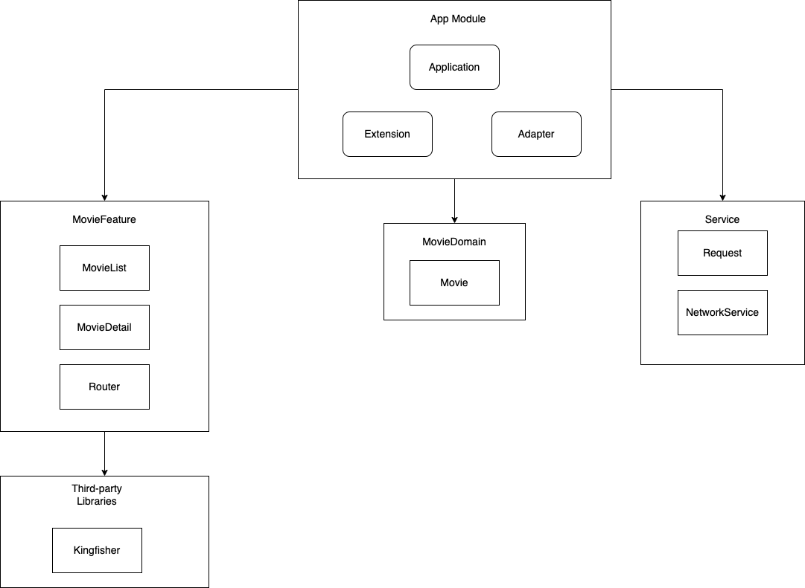
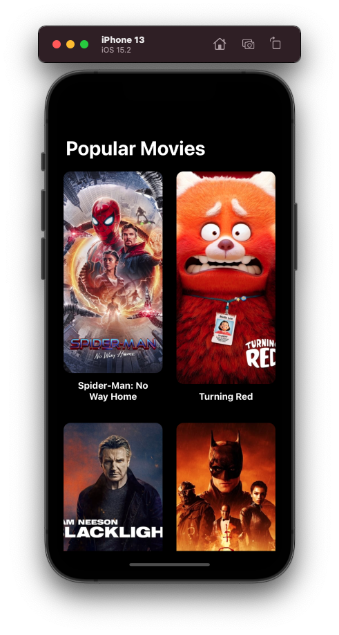
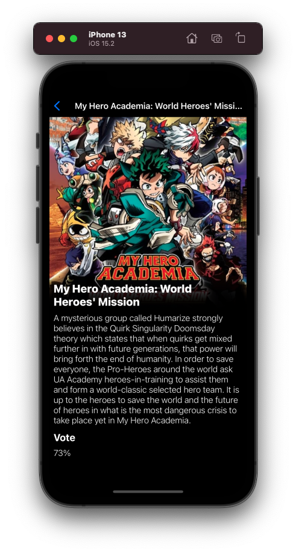

## Modular Movie App
Create movie application using modular design architecture using Swift Package Manager

## Architecture

The purpose of this architecture is to prepare giant and large project, I want to make all the modules is loose coupling so we can reuse easily. This approach also enable us to extend the feature easily

## Medium Article
https://tifoputra.medium.com/prepare-architecture-for-large-ios-application-3ceb8472eb62

## Demo

    
    

